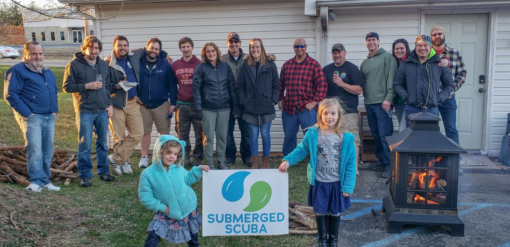
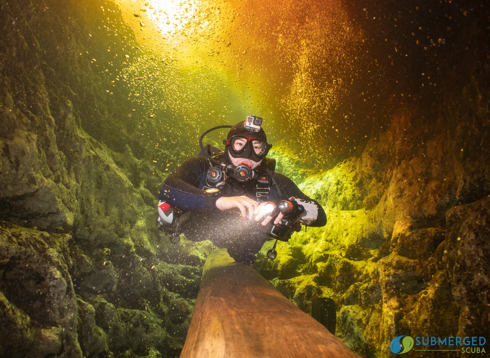

---
header:
  caption: ""
  image: ""
layout: docs
title: SCUBA Diving
---

The underwater world is an unique and amazing place.
For me, it's one of the few moments where I can tune everything out and just focus on the experience,
and take long slow deep medative breaths.

One of my fellow scuba instructor candidates,
[Michael Nappier](http://www.vetmed.vt.edu/people/bios/nappier.asp),
is a veterinarian who is using SCUBA diving to address the disproportionately high suicide rates in the profession.
Self-care has been a growing topic within the data science community,
and I aim to bring the same passion and awe I have of diving to them,
as a newly minted
[SDI Open Water Scuba Diver Instructor (OWSDI)](https://www.tdisdi.com/sdi/get-certified/instructor-course/).

Most of my dive training is by Scott Sanders and Mark Guenther from
[Submerged Scuba](https://www.submergedscuba.com/), based out of
[Christiansburg, VA](https://goo.gl/maps/hv9JuJyau8L4cRaV8) in the
[New River Valley](https://en.wikipedia.org/wiki/New_River_Valley).
I also dive a lot with the
[Scuba Club at Virginia Tech](http://www.scuba.org.vt.edu/).

----------

I am a
[TDI Intro to Cave Diver](https://www.tdisdi.com/tdi/get-certified/intro-to-cave-diver/).
One of the most amazing feelings you get from cave diving is the sense of flying as you are foating though air-clear water.
Photos of my training dives can be found [here](https://www.facebook.com/pg/DiveSubmerged/photos/?tab=album&album_id=2107886025914392&__tn__=-UC-R).

In the meantime check out my first cave dives in
[Peacock Springs](https://www.floridastateparks.org/parks-and-trails/wes-skiles-peacock-springs-state-park)
in May where I stayed at
[Dive Outpost](http://www.diveoutpost.com/) with
[Submerged Scuba](https://www.submergedscuba.com/) and my buddy
[Tyler](https://www.youtube.com/channel/UCREnYpjz-KH4_51GixTr_Zw).


