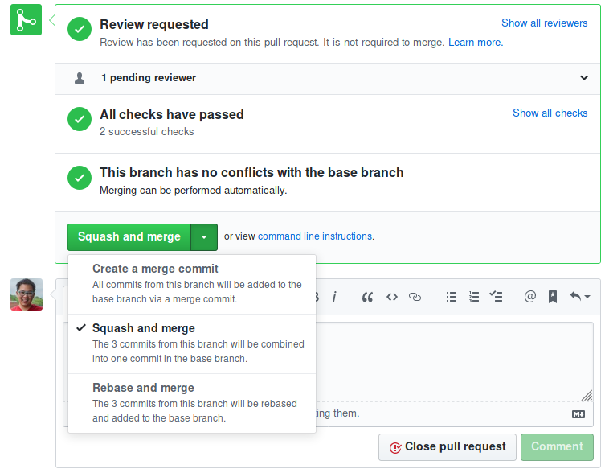

I have a love-hate relationship with Git.
It took me years of following cookbooks and following strict set of commands to
get a sense of how it works.
I still have to spend time wrangling Git at times,
but I've gotten to the point where I'm just annoyed, instead of scared.
Here is the branching-squash-and-merge workflow I've been using at RStudio.

Also, sorry I may be glossing over some of the Git basics in this post...

<!-- more -->

At RStudio, I'm using a brancing workflow where I am added directly as a collaborator to a project.
I still have to create pull requests for review,
but contrast this with me forking the repository and creating a pull regrest from my copy (`origin`)
to the parent repository (`upstream`).

Every workflow has benefits and drawbacks.
The current workflow I'm using is a "squash and merge".
Where all the commits in a pull request are "squashed" into a single commit when it it merged into master.
This means the main commit history is *super* clean,
and potentially sets up the repository to create automatic change logs or `NEWS` reports.
The downside is if you start branching off other branches (instead of the main `master`),
you'll have to `rebase` or `cherry-pick` to update the branches after a branch gets merged.

# The general problem

```
m1-m2-m3 # the master branch
       \
        x11-x12-x13 # example branch_1
                  \
                   y21-y22-y23 # example branch_2 that depends on branch_1
```

After a squash and merge the Git DAG looks like this

```
m1-m2-m3-s1 # master branch + squash-merge
       \
        x11-x12-x13 # commits from branch_1 still exist
                  \
                   y21-y22-y23 # commits from branch_2 still exist
```

You can't simply just squash merge `branch_2`, becuase the commits from `branch_1`
are technically still part of the history of `branch_2`,
so a rebase of `branch_2` against the new master will cause conflicts,
*and* I'll have duplicate messages if I do another squash+merge of `branch_2`.

If you did a `rebase` you'll end up with this:

```bash
git checkout branch_2 # make sure you're on branch_2
git rebase master
# fix conflicts
# so many conflicts
```

```
m1-m2-m3-s1 # master branch + squash-merge
          \
           x11-x12-x13-y21-y22-y23 # commits from branch_1 and branch_2
```

Instead, you need to `git cherry-pick` the commits against the updated master
with just the commits from `branch_2`.

```bash
git checkout master # go to master branch so you can cherry-pick commits on top
git cherry-pick y21^..y23 # this is how to cherry-pick multiple commits
# (note the ^ to also include commit y21, otherwise it is left exclusive)
```

```
m1-m2-m3-s1 # master branch + squash-merge
       \  \
        \  y21-y22-y23 # cherry-pick commits from branch_2 # this is good
         \
          x11-x12-x13 # commits from branch_1 still exist # already in s1
```

We don't need the commits from branch one anymore (`x11` to `x13` in the example),
so we can deleate that branch using `git branch -D branch_1`,
note you have to use a force delete with the `-D` flag,
because git does not think that `branch_1` was merged because we did a squash+merge.
Otherwise you would've been able to use the lowercase `-d` flag to delete the branch.

```
m1-m2-m3-s1 # master branch + squash-merge
          \
           y21-y22-y23 # cherry-pick commits from branch_2 # yay!
```

Now we finally get everthing up to date, and can re-update the pull request for branch 2
by doing a force push: `git push -f origin master`.

# In the real world

The PR process is the same as usual:

1. Create a branch
2. Push the branch to the remote (i.e., Github, in this case)
3. Pull request!

However, Github now gives you an option of which *green* button you want!
Specifically, the option to "Squash and merge"



This is fine when you have a totally independent PR
and there's no other work that is based of the current work on that branch.
However here's an example where I created separate branches for each "feature",
but they all rely on the previous feature.

Output of my `git log --oneline --graph --decorate --all`, which I have aliased as `git l`

Here's the current state we're in after we perform a squash+merge on GitHub

```
              vignettes
             /
older_commits
             \
              master
```

Here's what the actual state of the repository looks like.

```
dchen@longclaw [~/git/hub/gradethis]  (vignettes) 
[10:51:06] $ git l
* 16f4b6b (HEAD -> vignettes) intro to gradethis for learnr docs
* b4e2873 (origin/vignettes) emphasize not to use ==
* f66aa39 i don't want to stash
| * feb82b3 (origin/gh-pages) Deploy rstudio-education/gradethis to github.com/rstudio-education/gradethis.git:gh-pages
| * a195fa3 (origin/master, origin/HEAD) fix gradethis demo (#70)
| | * 4aaee31 (origin/compare_default_formals, compare_default_formals) call_standarise_formals
| | * 19354dd refactor is_code_same to is_code_identical
| | * 5591ae8 rename fxn code_is_same -> is_code_same
| |/  
| | * 91cf16e (update_grading_demo) fix gradethis demo
| |/  
| * 9083fc8 (me/master, master) rename functions per #65 update docs and tests (#72)
| * 5ec1144 Docs to markdown per #68 by @andrie + Barret changes (#69)
| * 9cc3d6d Test result api fixes#60 (#63)
|/  
* d5cf9de Doc fixes (#62) and function pruning

```

What we want is something like this:

```
older_commits
             \
              master
                    \
                     vignettes
```

First we pull and update `master`

```
dchen@longclaw [~/git/hub/gradethis]  (master) 
[10:51:18] $ git pull origin master
From github.com:rstudio-education/gradethis
 * branch            master     -> FETCH_HEAD
Updating 9083fc8..a195fa3
Fast-forward
 inst/tutorials/grading-demo/grading-demo.Rmd | 249 +++++++++++++++++++++++++++++++++++++++++++++++++++++++++++++++++++++++++++++++++++-----------------------------------------------------------------------------------------------------
 1 file changed, 112 insertions(+), 137 deletions(-)
```

Now that master is up to date,

```
              vignettes
             /
older_commits
             \
              master-master # master has moved up a commit from pull
```

we can cherry-pick the commits of interest

```
dchen@longclaw [~/git/hub/gradethis]  (master) 
[10:51:30] $ git cherry-pick f66aa39^..16f4b6b
[master 28c7ebe] i don't want to stash
 Date: Wed Aug 14 10:03:25 2019 -0400
 3 files changed, 72 insertions(+)
 create mode 100644 vignettes/000-introduction_to_gradethis.Rmd
 create mode 100644 vignettes/010-using_equal.Rmd
 create mode 100644 vignettes/990-developers_guide.Rmd
[master 9b84be6] emphasize not to use ==
 Date: Wed Aug 14 11:44:36 2019 -0400
 1 file changed, 4 insertions(+), 4 deletions(-)
[master 846bb18] intro to gradethis for learnr docs
 Date: Tue Aug 27 10:51:06 2019 -0400
 1 file changed, 151 insertions(+), 9 deletions(-)

```

Note that I used the `<commit>^..<commit>` notation while `cherry-pick`ing.
The `^` means to also include that commit, otherwise it will start from that commit,
but not include it (i.e., left exclusive).

If you wanted to not use the `^` you need to pick the previous commit hash.
In my case it would've been `d5cf9de`.

Now, we need to clean up the references to our branch.
Since we `cherry-pick`ed commits on master we're actually still on master.
So we need to do update where our branches are pointing to by using `git reset --hard <commit>

First we checkout the `vignettes` branch,

```
dchen@longclaw [~/git/hub/gradethis]  (master) 
[10:51:46] $ git checkout vignettes 
Switched to branch 'vignettes'
```

```
dchen@longclaw [~/git/hub/gradethis]  (vignettes) 
[10:51:52] $ git l
* 846bb18 (master) intro to gradethis for learnr docs
* 9b84be6 emphasize not to use ==
* 28c7ebe i don't want to stash
* a195fa3 (origin/master, origin/HEAD) fix gradethis demo (#70)
| * 16f4b6b (HEAD -> vignettes) intro to gradethis for learnr docs
| * b4e2873 (origin/vignettes) emphasize not to use ==
| * f66aa39 i don't want to stash
| | * feb82b3 (origin/gh-pages) Deploy rstudio-education/gradethis to github.com/rstudio-education/gradethis.git:gh-pages
| | * 4aaee31 (origin/compare_default_formals, compare_default_formals) call_standarise_formals
| | * 19354dd refactor is_code_same to is_code_identical
| | * 5591ae8 rename fxn code_is_same -> is_code_same
| |/  
|/|   
| | * 91cf16e (update_grading_demo) fix gradethis demo
| |/  
|/|   
* | 9083fc8 (me/master) rename functions per #65 update docs and tests (#72)
* | 5ec1144 Docs to markdown per #68 by @andrie + Barret changes (#69)
* | 9cc3d6d Test result api fixes#60 (#63)
|/  
* d5cf9de Doc fixes (#62) and function pruning
```

and then set it to the correct commit location.

```
dchen@longclaw [~/git/hub/gradethis]  (vignettes) 
[10:52:04] $ git reset --hard 846bb18
HEAD is now at 846bb18 intro to gradethis for learnr docs
```

We then repeat the process for the `master` branch.

First `checkout master`

```
dchen@longclaw [~/git/hub/gradethis]  (vignettes) 
[10:52:07] $ git checkout master
Switched to branch 'master'
Your branch is ahead of 'origin/master' by 3 commits.
  (use "git push" to publish your local commits)
```

Then `reset --hard` to the correct location:

```
dchen@longclaw [~/git/hub/gradethis]  (master) 
[10:52:11] $ git reset --hard a195fa3
HEAD is now at a195fa3 fix gradethis demo (#70)
```

Now everything is in the right place

```
older_commits
             \
              master
                    \
                     vignettes
```

```
dchen@longclaw [~/git/hub/gradethis]  (master) 
[10:52:21] $ git l
* 846bb18 (vignettes) intro to gradethis for learnr docs
* 9b84be6 emphasize not to use ==
* 28c7ebe i don't want to stash
* a195fa3 (HEAD -> master, origin/master, origin/HEAD) fix gradethis demo (#70)
| * feb82b3 (origin/gh-pages) Deploy rstudio-education/gradethis to github.com/rstudio-education/gradethis.git:gh-pages
| * 4aaee31 (origin/compare_default_formals, compare_default_formals) call_standarise_formals
| * 19354dd refactor is_code_same to is_code_identical
| * 5591ae8 rename fxn code_is_same -> is_code_same
|/  
| * 91cf16e (update_grading_demo) fix gradethis demo
|/  
* 9083fc8 (me/master) rename functions per #65 update docs and tests (#72)
* 5ec1144 Docs to markdown per #68 by @andrie + Barret changes (#69)
* 9cc3d6d Test result api fixes#60 (#63)
| * b4e2873 (origin/vignettes) emphasize not to use ==
| * f66aa39 i don't want to stash
|/  
* d5cf9de Doc fixes (#62) and function pruning
```

Finally, we can update the GitHub remote by force bushing the branch
(remember to be on the branch before pushing).

```
dchen@longclaw [~/git/hub/gradethis]  (master) 
[10:53:25] $ git checkout vignettes 
Switched to branch 'vignettes'
```

```
dchen@longclaw [~/git/hub/gradethis]  (vignettes) 
[10:53:30] $ git push -f origin vignettes 
Enumerating objects: 15, done.
Counting objects: 100% (15/15), done.
Delta compression using up to 4 threads
Compressing objects: 100% (14/14), done.
Writing objects: 100% (14/14), 3.27 KiB | 3.27 MiB/s, done.
Total 14 (delta 7), reused 0 (delta 0)
remote: Resolving deltas: 100% (7/7), completed with 1 local object.
To github.com:rstudio-education/gradethis.git
 + b4e2873...846bb18 vignettes -> vignettes (forced update)
```
 
The final Graph now looks like this

```
dchen@longclaw [~/git/hub/gradethis]  (vignettes) 
[10:54:13] $ git l
* 846bb18 (HEAD -> vignettes, origin/vignettes) intro to gradethis for learnr docs
* 9b84be6 emphasize not to use ==
* 28c7ebe i don't want to stash
* a195fa3 (origin/master, origin/HEAD, master) fix gradethis demo (#70)
| * feb82b3 (origin/gh-pages) Deploy rstudio-education/gradethis to github.com/rstudio-education/gradethis.git:gh-pages
| * 4aaee31 (origin/compare_default_formals, compare_default_formals) call_standarise_formals
| * 19354dd refactor is_code_same to is_code_identical
| * 5591ae8 rename fxn code_is_same -> is_code_same
|/  
| * 91cf16e (update_grading_demo) fix gradethis demo
|/  
* 9083fc8 (me/master) rename functions per #65 update docs and tests (#72)
* 5ec1144 Docs to markdown per #68 by @andrie + Barret changes (#69)
```

# Conclusion

It's taken me many years to be comfortable with Git.
My previous go-to method was to `rebase` one branch on top of the other,
but with the squash-and-merge method, a lot of commits get repeated,
and it just makes `rebase`ing a pain with all the commits and merge conflicts.

In this particular workflow I found `cherry-pick` to be way more convenient,
and led to fewer merge conflicts.

Again, the notation for `cherry-pick` is weird, in that it is *left exclusive* unless you put in the `^`,
i.e.,

```
git cherry-pick <commit-start>^..<commit-end>
```

not

```
git cherry-pick <commit-start>..<commit-end>
```
