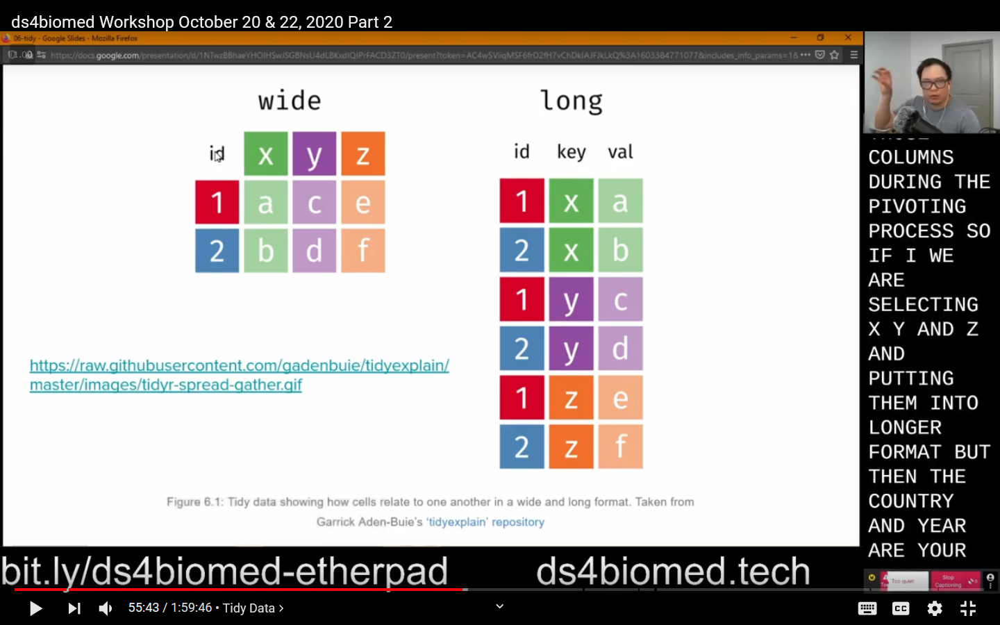
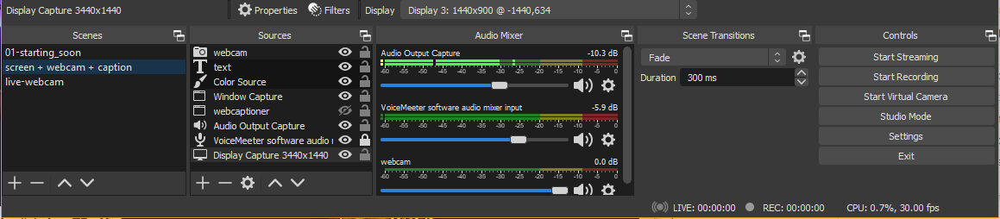

Open Broadcaster Software (OBS) is a featured and popular used to lay out your screen for recording and streaming.
V26 of OBS Studio was released mid October 2020,
and it ships with a virtual camera feature (windows).
This allows you to use the OBS Studio output as the camera input for other programs (e.g., video conferencing software).

<!-- more -->

For teaching purposes, this means you have much more control when you are trying to teach
online (and in person) since OBS gives you many options on what and how something is presented.
OBS also allows you to setup "scenes" so you can potentially share an entire screen,
or a specific set of application windows all with separate screen overlays.
For me I was able to more efficiently lay out my screen with what I'm presenting,
text overlays with quick links, and a live caption as I was teaching.

The virtual camera used to be an optional
[plugin](https://obsproject.com/forum/resources/obs-virtualcam.949/)
that needed to be installed,
but this current version has been cleaned up with bug fixes.
It seems like it's currently Windows only,
and you may still need to use the old plugins for Mac + Linux.

For my dissertation,
I am writing an online resource that aims to teach
data science skills focused towards people who work in the medical and biomedical sciences ([ds4biomed](https://ds4biomed.tech/)).
I just finished giving my first workshop using these materials which you can find
[here (part 1)](https://www.youtube.com/watch?v=nQ4lbmKD1no)
and
[here (part 2)](https://www.youtube.com/watch?v=2eCSmIQN2hU).
I wanted a way to be able to share my screen but also show a live caption at the same time.

In the past I would share my screen and open windows up in the screen,
but that method wasted a lot of screen space to lay out all the components I wanted.
OBS give me much more flexibility with how big each components takes up on the canvas.

Here's an example of what was **presented** to the learners over Zoom.

## Setting up OBS

Setting up OBS Studio is a separate post on its own.
Luckily it's used by streamers,
so there are lots of YouTube guides on how to use OBS

Here are 2 resources

1. [Gaming Careers Guide](https://www.youtube.com/watch?v=Zt_HVScA3Js)
2. [Alpha Gaming Guide](https://www.youtube.com/watch?v=EuSUPpoi0Vs)

## My setup

I only have 1 scene when I'm teaching, but OBS gives you the option to have multiple scenes that you can toggle between.

My main teaching screen scene:

1. Video Capture Device: Webcam
2. Text: Quick links to the Etherpad and workshop content
3. Color Source: Black bar to cover the Windows taskbar for the Text to show
4. Window Capture: Chrome window opened to Web Captioner
5. Audio Output Capture: Used to capture sound from the computer (from applications like zoom or videos)
6. Audio Input Capture: My microphone
7. Display Capture: Screen I use for screen sharing.
  - An option here could be a series of application window captures instead of sharing the entire screen
  - You can have your own layout of source code and terminal output and not worry about windows overlapping on your end

Other things that could be useful is to have a scene that is setup in advanced to a certain part of the screen,
e.g., the source code, or output,
so you can zoom in to a certain area for emphasis and clarity.

You can also have a separate scene for a timer if you want a more explicit break timer.

Another useful scene is just your webcam and audio input capture so your webcam shows up like a normal webcam to people.
The Scenes let you swap between all the different views out of OBS and into the virtual camera on the fly.

## Using the Virtual Camera

Once you have OBS setup with your scenes and sources,
you can click the "Start Virtual Camera" button.
Once you started that, you will see a new "webcam" option in your video conference software that will output what your OBS preview shows.

When using video conferencing software, e.g.,. Zoom, to teach,
you need to remember you are no longer "sharing" your screen,
since your webcam display is already setup to share your screen,
so you need to tell people to either "pin" your video so it does not loose focus when other people talk,
or mute microphones so people do not take away your focus.
How this is done will vary between applications.

## Other OBS tips

Using OBS you can set it up to stream to services like Twitch or YouTube,
and it also gives you the ability to "record" the stream.
If you do decide to record out of OBS,
I suggest you use `.mkv` format to record since `mkv` files will still work if something happens and the recording crashes.
You can use programs like [HandBrake](https://handbrake.fr/)
to convert video formats.

## Learner screen layout

I wrote a post earlier this year for The Carpentries on how learners
may lay out their screens during an online workshop.
You can see the blog post here: 
https://carpentries.org/blog/2020/06/online-workshop-logistics-and_screen-layouts/

## Summary

Using the OBS virtual camera for online teaching gives the instructor a lot of flexibility on what and how something would be presented to the learners.
For instructors who have limited screen space,
OBS allows you to lay out individual application windows so you can have your notes over what is presented without it affecting what the learners see.
Additionally, OBS's scenes allow the instructor to pre set up different views that can be changed during the lesson as needed.
There is a learning curve to OBS, but because of it's use in the streaming community,
there are a plethora of resources available.
