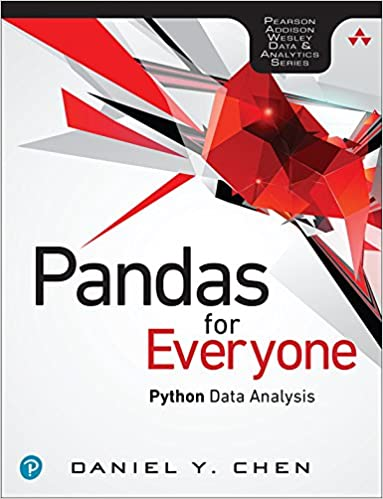

## [Pandas for Everyone: Python Data Analysis](https://ds4biomed.tech) is an introductory book that teaches Python from a data perspective by using the Pandas data processing library.

---

- Pandas for Everyone: Python Data Analysis, First Edition
- by Daniel Y. Chen
- Released December 2017
- Publisher(s): Addison-Wesley Professional
- ISBN: 9780134547046

### Book Description

The Hands-On, Example-Rich Introduction to Pandas Data Analysis in Python.

Today, analysts must manage data characterized by extraordinary variety, velocity, and volume. Using the open source Pandas library, you can use Python to rapidly automate and perform virtually any data analysis task, no matter how large or complex. Pandas can help you ensure the veracity of your data, visualize it for effective decision-making, and reliably reproduce analyses across multiple datasets.

Pandas for Everyone brings together practical knowledge and insight for solving real problems with Pandas, even if you’re new to Python data analysis. Daniel Y. Chen introduces key concepts through simple but practical examples, incrementally building on them to solve more difficult, real-world problems.

Chen gives you a jumpstart on using Pandas with a realistic dataset and covers combining datasets, handling missing data, and structuring datasets for easier analysis and visualization. He demonstrates powerful data cleaning techniques, from basic string manipulation to applying functions simultaneously across dataframes.

Once your data is ready, Chen guides you through fitting models for prediction, clustering, inference, and exploration. He provides tips on performance and scalability, and introduces you to the wider Python data analysis ecosystem.

- Work with DataFrames and Series, and import or export data
- Create plots with matplotlib, seaborn, and pandas
- Combine datasets and handle missing data
- Reshape, tidy, and clean datasets so they’re easier to work with
- Convert data types and manipulate text strings
- Apply functions to scale data manipulations
- Aggregate, transform, and filter large datasets with groupby
- Leverage Pandas’ advanced date and time capabilities
- Fit linear models using statsmodels and scikit-learn libraries
- Use generalized linear modeling to fit models with different response variables
- Compare multiple models to select the “best”
- Regularize to overcome overfitting and improve performance
- Use clustering in unsupervised machine learning

### Table of Contents

    Cover Page
    About This E-Book
    Title Page
    Copyright Page
    Dedication Page
    Contents
    Foreword
    Preface
    Acknowledgments
    About the Author
    I Introduction
        1 Pandas DataFrame Basics
            1.1 Introduction
            1.2 Loading Your First Data Set
            1.3 Looking at Columns, Rows, and Cells
            1.4 Grouped and Aggregated Calculations
            1.5 Basic Plot
            1.6 Conclusion
        2 Pandas Data Structures
            2.1 Introduction
            2.2 Creating Your Own Data
            2.3 The Series
            2.4 The DataFrame
            2.5 Making Changes to Series and DataFrames
            2.6 Exporting and Importing Data
            2.7 Conclusion
        3 Introduction to Plotting
            3.1 Introduction
            3.2 Matplotlib
            3.3 Statistical Graphics Using matplotlib
            3.4 Seaborn
            3.5 Pandas Objects
            3.6 Seaborn Themes and Styles
            3.7 Conclusion
    II Data Manipulation
        4 Data Assembly
            4.1 Introduction
            4.2 Tidy Data
            4.3 Concatenation
            4.4 Merging Multiple Data Sets
            4.5 Conclusion
        5 Missing Data
            5.1 Introduction
            5.2 What Is a NaN Value?
            5.3 Where Do Missing Values Come From?
            5.4 Working With Missing Data
            5.5 Conclusion
        6 Tidy Data
            6.1 Introduction
            6.2 Columns Contain Values, Not Variables
            6.3 Columns Contain Multiple Variables
            6.4 Variables in Both Rows and Columns
            6.5 Multiple Observational Units in a Table (Normalization)
            6.6 Observational Units Across Multiple Tables
            6.7 Conclusion
    III Data Munging
        7 Data Types
            7.1 Introduction
            7.2 Data Types
            7.3 Converting Types
            7.4 Categorical Data
            7.5 Conclusion
        8 Strings and Text Data
            8.1 Introduction
            8.2 Strings
            8.3 String Methods
            8.4 More String Methods
            8.5 String Formatting
            8.6 Regular Expressions (RegEx)
            8.7 The regex Library
            8.8 Conclusion
        9 Apply
            9.1 Introduction
            9.2 Functions
            9.3 Apply (Basics)
            9.4 Apply (More Advanced)
            9.5 Vectorized Functions
            9.6 Lambda Functions
            9.7 Conclusion
        10 Groupby Operations: Split–Apply–Combine
            10.1 Introduction
            10.2 Aggregate
            10.3 Transform
            10.4 Filter
            10.5 The pandas.core.groupby .DataFrameGroupBy Object
            10.6 Working With a MultiIndex
            10.7 Conclusion
        11 The datetime Data Type
            11.1 Introduction
            11.2 Python’s datetime Object
            11.3 Converting to datetime
            11.4 Loading Data That Include Dates
            11.5 Extracting Date Components
            11.6 Date Calculations and Timedeltas
            11.7 Datetime Methods
            11.8 Getting Stock Data
            11.9 Subsetting Data Based on Dates
            11.10 Date Ranges
            11.11 Shifting Values
            11.12 Resampling
            11.13 Time Zones
            11.14 Conclusion
    IV Data Modeling
        12 Linear Models
            12.1 Introduction
            12.2 Simple Linear Regression
            12.3 Multiple Regression
            12.4 Keeping Index Labels From sklearn
            12.5 Conclusion
        13 Generalized Linear Models
            13.1 Introduction
            13.2 Logistic Regression
            13.3 Poisson Regression
            13.4 More Generalized Linear Models
            13.5 Survival Analysis
            13.6 Conclusion
        14 Model Diagnostics
            14.1 Introduction
            14.2 Residuals
            14.3 Comparing Multiple Models
            14.4 k-Fold Cross-Validation
            14.5 Conclusion
        15 Regularization
            15.1 Introduction
            15.2 Why Regularize?
            15.3 LASSO Regression
            15.4 Ridge Regression
            15.5 Elastic Net
            15.6 Cross-Validation
            15.7 Conclusion
        16 Clustering
            16.1 Introduction
            16.2 k-Means
            16.3 Hierarchical Clustering
            16.4 Conclusion
    V Conclusion
        17 Life Outside of Pandas
            17.1 The (Scientific) Computing Stack
            17.2 Performance
            17.3 Going Bigger and Faster
        18 Toward a Self-Directed Learner
            18.1 It’s Dangerous to Go Alone!
            18.2 Local Meetups
            18.3 Conferences
            18.4 The Internet
            18.5 Podcasts
            18.6 Conclusion
    VI Appendixes
        A Installation
            A.1 Installing Anaconda
            A.2 Uninstall Anaconda
        B Command Line
            B.1 Installation
            B.2 Basics
        C Project Templates
        D Using Python
            D.1 Command Line and Text Editor
            D.2 Python and IPython
            D.3 Jupyter
            D.4 Integrated Development Environments (IDEs)
        E Working Directories
        F Environments
        G Install Packages
            G.1 Updating Packages
        H Importing Libraries
        I Lists
        J Tuples
        K Dictionaries
        L Slicing Values
        M Loops
        N Comprehensions
        O Functions
            O.1 Default Parameters
            O.2 Arbitrary Parameters
        P Ranges and Generators
        Q Multiple Assignment
        R numpy ndarray
        S Classes
        T Odo: The Shapeshifter
    Index
    Code Snippets
