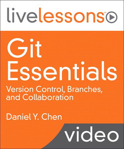

## [Git Essentials LiveLessons](https://www.oreilly.com/library/view/git-essentials-livelessons/9780134655284/) is an online video course.

---

- Git Essentials LiveLessons
- by Daniel Y. Chen
- Publisher: Addison-Wesley Professional
- Release Date: September 2016
- ISBN: 9780134655284

### Video Description

Git has emerged as the leading revision control system for open source projects. Git is a distributed revision control and source code management (SCM) system with an emphasis on speed. Description

Git Essentials LiveLessons teaches the skills necessary to version control with git. The first part of the course begins with the basics of Git and how to use it as an individual programmer. Part 1: Git Fundamentals covers installation and setup, fundamental commands, and how to use remote and branches in git using Github as the online hosting service to lay the foundation for more advanced workflows.

After the basics are covered, Part 2: Collaborating with Git shows how to work collaboratively with teams with git. Three common ways of collaboration are covered, including: adding other users to your project repository, forking a copy of repository and submitting changes for review, and finally using the git flow workflow.

### Skill Level

Beginner

### You Will Learn How To

- Set up and install git
- Use basic git commands
- Understand remotes and branches
- Add a collaborator
- Push/pull branches and incorporate changes
- Fork a repository and make changes while staying in sync
- Work with branches
- Use a Git Flow workflow

### Who Should Take This Course

Individuals who want to incorporate version control and more robust collaboration methods into their workflow.

### Course Pre-Requisites

Basic command line skills: - moving to directories - creating and editing plain text files

### Table of Contents

Introduction to Git Essentials

Introduction to Part I

Part I: Git Basics

Lesson 1: Setting Up Git

Learning objectives

1.1 Understand what can Git do for you

1.2 Install Git

1.3 Configure Git

Lesson 2: Understanding and Using Git- The Basics

Learning objectives

2.1 Create a Git repository (init, status)

2.2 Track changes (add, commit, log; what is master)

2.3 Look at differences

2.4 Look around

2.5 Undo changes

2.6 Ignore things in Git

Lesson 3: Remotes and Branches

Learning objectives

3.1 Understand what GitHub is and how it's used

3.2 Use remotes with https

3.3 Use remotes with ssh

3.4 Utilize self collaboration

3.5 Use Git for project management

3.6 Use branches on your own

3.7 Understand Git workflows

3.8 Incorporating changes after you branch

3.9 Use Git GUIs

Introduction to Part II

Part II: Collaborating with Git

Lesson 4: Adding a Collaborator

Learning objectives

4.1 Add a collaborator, push and pull down changes

4.2 Push/pull with branches and request a pull

4.3 Incorporate changes in existing branches

Lesson 5: Forking Workflow of Collaboration

Learning objectives

5.1 Fork a repository and making a change as a collaborator

5.2 Working with changes and staying in sync

5.3 Working with branches

Lesson 6: Git Flow Workflow of Collaboration

Learning objectives

6.1 Forking and making changes on a Git Flow repository

6.2 Working with changes and staying in sync

6.3 Staying in sync with conflicts

Summary
