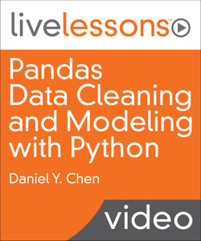

## [Pandas Data Cleaning and Modeling with Python](https://www.oreilly.com/library/view/pandas-data-cleaning/9780135170199/) is an online video course.

---

- Pandas Data Cleaning and Modeling with Python
- by Daniel Y. Chen
- Publisher: Addison-Wesley Professional
- Release Date: January 2018
- ISBN: 9780135170199

### Video Description

The perfect follow up to Pandas Data Analysis with Python Fundamentals LiveLessons for the aspiring data scientist

### Overview

In Pandas Data Cleaning and Modeling with Python LiveLessons, Daniel Y. Chen builds upon the foundation he built in Pandas Data Analysis with Python Fundamentals LiveLessons. In this LiveLesson Dan teaches you the techniques and skills you need to know to be able to clean and process your data. Dan shows you how to do data munging using some of the built-in Python libraries that can be used to clean data loaded into Pandas. Once your data is clean you are going to want to analyze it, so next Dan introduces you to other libraries that are used for model fitting.

### Skill Level

Beginner to Intermediate

### Learn How To

Use pandas data types Convert data types Use string methods and regular expressions Apply functions to data Aggregate, transform, and filter data Use pandas and Python date and time methods Model data

### Who Should Take This Course

Those new to data science, particularly those with Python programming experience

### Course Requirements

Basic programming skills, particularly in Python

### Lesson Descriptions

#### Lesson 1: Pandas Data Types

These lessons pick up where Pandas Data Analysis with Python Fundamentals LiveLessons left off. You learned the basics of subsetting, combining, and reshaping data. Now you can start learning how to cleaning your data. That begins with learning data types and how to find them in your data. Next comes the converting from one type to another, including converting data into numeric and string values. The lesson finishes with categorical data.

#### Lesson 2: Unstructured Text and Strings in Pandas

There are vast stores of data available as unstructured text. Understanding how to work with text data in Python is important when your dataset has text data that needs to be processed. The lesson begins with a basic overview of strings and the built-in python string methods. Next, Dan covers how to format strings. This will make your code more legible and can make the output more consistent and “prettier.” Dan then introduces regular expressions with the built-in regular expressions library (2.5) and how you can use regular expressions to do pattern matching. Finally, Dan shows you a quick example of the better, but not built-in, regex library.

#### Lesson 3: Applying Functions to Data

Applying functions is a fundamental skill when working with data. Application of functions incorporates many skills used in programming and data analytics. Instead of writing for loops to perform calculations and data manipulations, we write functions that work on a column-by-column or row-by-row basis. Dan begins with a quick introduction to functions in Python. Then, he turns to using simple functions on a toy dataset to see how apply works. Next, he applies functions on an actual dataset. You then learn how to write vectorized functions, functions that work on an element-wise basis. Finally, Dan takes a look at lambda functions for one-off calculations.

#### Lesson 4: Breaking Up Computations Using groupby Operations: split-apply-combine

groupby operations follow the mantra of split-apply-combine. Where your data is split and partitioned by a variable or variables, functions are applied to each partition, and the results are combined back into a single result. This technique is utilized heavily on distributed systems when the data no longer can fit on a single machine. There are three common operations when performing a groupby. First, there is aggregation where you summarize your data into a single value. For example, calculating the average life expectancy across each year in your data would be aggregation. Transformation is done when you perform a specific calculation for each individual group. Next, there is filtration, where you reduce your data based on a calculation within a group.

Dan also looks further into the groupby object itself and how you can iterate over your groups. And finally, he demonstrates the multi-index and how you can chain multiple groupby calculations together.

#### Lesson 5: Dates and Times in Python and Pandas

One of pandas’ strong suits is handling dates and times in time-series data. There are many convenient functions and methods that make working and processing datetime data much easier in pandas. Dan begins by looking at Python’s datetime object and how to create them. Next, you learn how you can convert columns in your data into datetime objects. He then shows you how you can directly load data into a datetime without having an intermediate step and then convert it later. Once you have your data stored as a proper date and time object, Dan shows you how you can extract various datetime components and how you can perform calculations and create Timedeltas. Then Dan shows you other functions and methods you can perform on datetimes, and how you can download stock data from the internet. Once you have your data processed the way you want, Dan takes you back to the basics and you learn how you can leverage dates and times to subset your data. From there you learn how you can create ranges of dates, followed by an example of shifting date values. Finally, Dan covers how you can resample your dates and how you can convert dates and times across various time zones.

#### Lesson 6: Modeling: Connecting to the World Outside of Pandas

Once you have your data processed the way you want, you can begin modeling your data to gain insights. This lesson begins to expand our world within pandas to other Python libraries used to model data. Dan begins with linear regression and how it is performed in two very popular modeling libraries: statsmodels and scikit-learn. While linear regression is great if your outcome or response variable is continuous, you can use logistic regression when your outcome of interest is a binary variable. When you begin working with count data, you use a Poisson or negative binomial model, depending on the assumptions and characteristics of your data. Next, Dan introduces you to survival models, when you have censored data and want to model the time a particular event will occur. Dan then covers how you can perform model diagnostics and compare model performance by looking at residuals, ANOVA, AIC, BIC, and k-fold cross validation. He then covers how you can have a more parsimonious model that can better predict future data points by using regularization techniques, and the lesson concludes by introducing clustering techniques and how you can use principal components analysis to visualize your k-means results.
